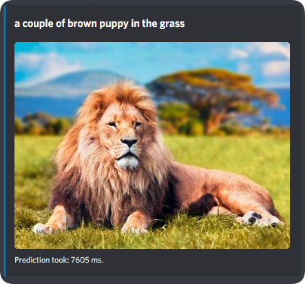

# Image Caption AI Discord Bot

Discord bot that captionizes any image using machine learning. The captioning functionality is a modified version of the code used in [TensorFlows tutorial](https://www.tensorflow.org/tutorials/text/image_captioning) on image captioning. 

## About

The bot is divided into a microservice architecture consisting of a C# console app running the bot and a RESTFul python service that contains the core logic. 

**Microservice: image-caption-service**

The core functionality is based on TensorFlows tutorial on image caption. However, the code has been refactored and useful comments has been added in an attempt to make the code more understandable and to separate responsibilities. 

Furtermore, it provides an RESTful API to query a caption based on a given image. 

Features include: 
- Pretrained weights
- Restful interface for requesting a caption on an image
- Easy Google Colab integration for further training
- Easy configuration 
- Reporting and metrics

**Microservice: discord-bot**

## Getting started

## Configuration

## Running the bot

### Running with Docker Compose

## Usage 

The application is very accurate and captionizes most images perfectly. 

